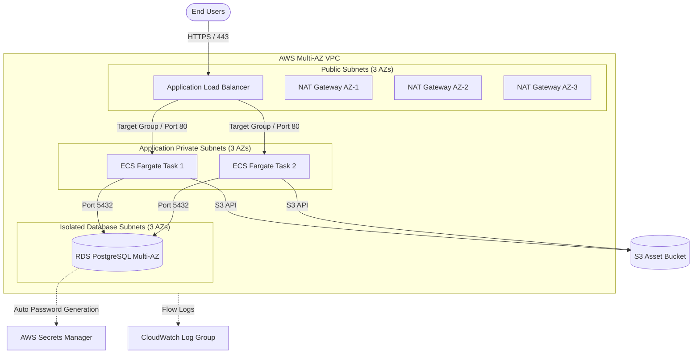

# Architecture & Operations Guide

This guide details the architecture, bootstrapping procedure, environment workflows, and operational runbooks for the multi-tier AWS platform built with `terraform-aws-modules`.

---

## 1. System Topology



---

## 2. Bootstrapping Remote State (S3 + DynamoDB)

Before provisioning any environment, initialize and provision the centralized remote state bucket and distributed lock table.

### Automated Setup

#### Option A: Windows PowerShell
```powershell
cd bootstrap
.\bootstrap-backend.ps1 -Region us-east-1 -BucketPrefix myorg-tf-state
```

#### Option B: Linux / macOS / Git Bash
```bash
cd bootstrap
chmod +x bootstrap-backend.sh
./bootstrap-backend.sh us-east-1 myorg-tf-state
```

The script will:
1. Verify active AWS credentials (`aws sts get-caller-identity`).
2. Run `terraform init` and `terraform apply -auto-approve` inside `bootstrap/`.
3. Auto-generate `backend.tf` files inside `environments/dev/` and `environments/prod/`.

---

## 3. Environment Deployment Workflow

### Development (`environments/dev`)

1. **Navigate to directory**:
   ```bash
   cd environments/dev
   ```
2. **Configure variables**:
   ```bash
   cp terraform.tfvars.example terraform.tfvars
   # Edit terraform.tfvars as needed
   ```
3. **Initialize and plan**:
   ```bash
   terraform init
   terraform plan -out=tfplan
   ```
4. **Deploy**:
   ```bash
   terraform apply tfplan
   ```

### Production (`environments/prod`)

Production includes:
- Multi-AZ NAT Gateways (one per AZ) for uninterrupted egress.
- Multi-AZ RDS PostgreSQL with deletion protection enabled.
- Automatic HTTPS redirection and strict TLS listeners.
- S3 asset tiering to Infrequent Access (90 days) and Glacier (180 days).

```bash
cd environments/prod
cp terraform.tfvars.example terraform.tfvars
terraform init
terraform plan -out=tfplan
terraform apply tfplan
```

---

## 4. Operational Runbooks

### Retrieving Database Credentials
The PostgreSQL database uses AWS Secrets Manager for master user credentials. The master password is not stored in plaintext in Terraform output:

```bash
# Get Secret ARN from outputs
SECRET_ARN=$(terraform output -raw database_secrets_manager_arn)

# Fetch current credentials JSON
aws secretsmanager get-secret-value --secret-id "$SECRET_ARN" --query SecretString --output text
```

### Deploying a New Container Image
To update the running ECS Fargate service with a newly built Docker container:

1. Update `container_image` in `terraform.tfvars`:
   ```hcl
   container_image = "123456789012.dkr.ecr.us-east-1.amazonaws.com/my-app:v1.1.0"
   ```
2. Apply the change:
   ```bash
   terraform apply -target=module.container_app
   ```
ECS will perform a rolling deployment (zero downtime) using ECS health check grace periods.

---

## 5. Zero-Downtime Refactoring with `moved` Blocks

If migrating from legacy raw resources (e.g., `aws_s3_bucket.legacy` or `aws_security_group.legacy`) to `terraform-aws-modules`, use `moved` blocks to eliminate resource destruction:

```hcl
# Example in main.tf
moved {
  from = aws_s3_bucket.legacy
  to   = module.s3_bucket.aws_s3_bucket.this[0]
}

moved {
  from = aws_s3_bucket_versioning.legacy
  to   = module.s3_bucket.aws_s3_bucket_versioning.this[0]
}
```

Verify that the plan shows **`0 to add, 0 to change, 0 to destroy`**:
```bash
terraform plan
```

---

## 6. CI/CD & GitHub Actions OIDC Setup

The repository includes a two-stage GitHub Actions pipeline:
- **`ci.yml`**: Runs on all pushes and PRs to check code formatting (`terraform fmt`), syntax analysis (`validate_terraform.py`), static analysis (`tflint`), and security vulnerability scans (`trivy` and `gitleaks`).
- **`deploy.yml`**: Authenticates securely via **AWS OIDC federation** without static access keys.

### Configuring GitHub Secrets for AWS OIDC

1. Enable OIDC in `bootstrap/terraform.tfvars`:
   ```hcl
   enable_github_oidc = true
   github_repo        = "my-org/my-repo"
   ```
2. Apply the bootstrap configuration to create the role:
   ```bash
   cd bootstrap
   terraform apply
   ```
3. Copy the output `github_actions_role_arn`.
4. In GitHub repository settings:
   - Navigate to **Settings > Secrets and variables > Actions**.
   - Add Secret: `AWS_OIDC_ROLE_ARN` = `<role-arn-from-bootstrap-output>`
   - Add Variable (optional): `AWS_REGION` = `us-east-1`

